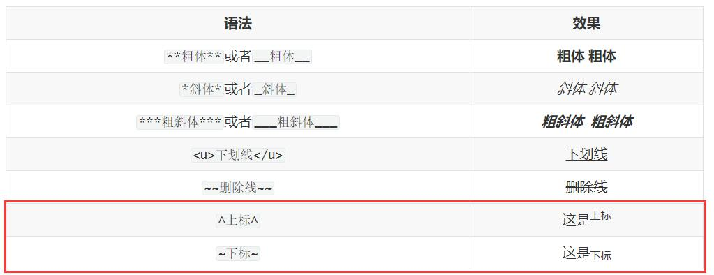
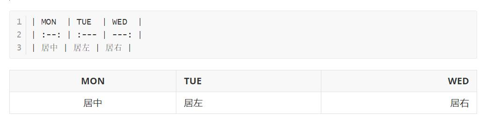
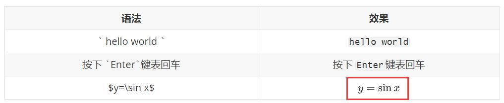
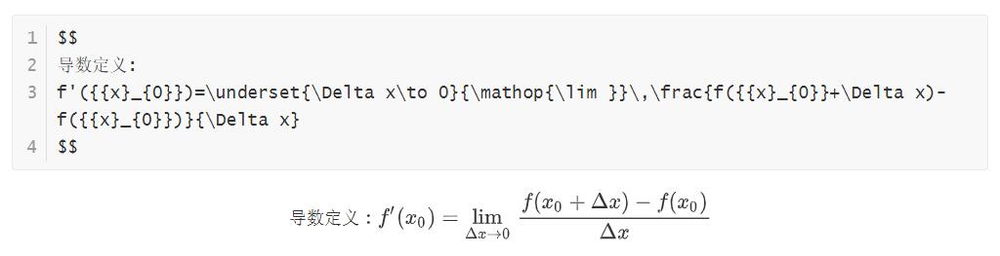

# 1. 说明

​	首次接触markdown，我写这篇文档的初衷是为了好好记录下自己学习的过程。

​	编辑器：推荐[Typora](https://www.typora.io/)，开源免费，简洁美观，与Markdown的简洁风格浑然一体。

​	在写本篇文章前我参考了两位前人的github，然后将自己的笔记与思考整理了出来。

跳转链接：

* [https://github.com/guodongxiaren/README](https://github.com/guodongxiaren/README)

* [https://github.com/younghz/Markdown](https://github.com/younghz/Markdown)

### 1.1 Markdown是什么？

**Markdown**是一种轻量级**标记语言**，它以**纯文本**形式（易读、易写、易更改）编写文档，对于图片，图表、数学公式、代码都有支持，并最终可以以HTML形式发布（现在由于编辑器的强大，已经支持PDF、WORD、RTF、Latex、Image等多种形式）。

当前许多网站都广泛使用Markdown来撰写帮助文档或是用于论坛上发表消息。国内的如：知乎、CSDN、简书、印象笔记等等一系列可编辑文章并发布的平台，甚至还能被使用来撰写电子书。

### 1.2 为什么使用它？

* **学习成本低** ，语法简单，让我们写作时可以更专注于文字内容
* **纯文本形式**，方便随时修改文章内容
* **简洁美观**，结构清晰，有着极简主义的影子
* **跨平台使用**，现在有越来越多的网站支持Markdown
* **支持导出多种文件格式**，MD、PDF、WORD、RTF、Latex、Image等等
* Word的替代好手，在没用过md的人面前用起来真是高大上，哈哈哈

### 1.3 有何缺点

Markdown有一个很令人头疼的问题就是它的标准不统一，不能完全统一。

但常见的语法基本一致，少数的要需要你去了解该平台或者编辑器是否支持该语法


# 2. 正文

由于github与Typora编辑器所支持的语法有不同，我下面会先介绍他们共有语法

然后会在最后面介绍Typora所单独支持的语法（采用贴图的形式）

### 2.1 标题

这个标题的用法非常简单，如果真的把效果实现出来的话会看起来很丑:joy::joy:，请大家见谅

还要记住的是，在一般的编辑器里，标题是具有索引作用的，所以小号的标题与加粗了的字体并**不等价**

|      语法       | 效果（在这里看不出效果） |
| :-------------: | :----------------------: |
|   `# + 空格`    |        # 一级标题        |
|   `## + 空格`   |       ## 二级标题        |
|  `### + 空格`   |       ### 三级标题       |
|  `#### + 空格`  |      #### 四级标题       |
| `##### + 空格`  |      ##### 五级标题      |
| `###### + 空格` |     ###### 六级标题      |

### 2.2 字体

这里面的字体部分可以**套用**，就像粗斜体一样

|               语法               |            效果            |
| :------------------------------: | :------------------------: |
|     `**粗体**`或者`__粗体__`     |     **粗体** __粗体__      |
|       `*斜体*`或者`_斜体_`       |       *斜体* _斜体_        |
| `***粗斜体***`或者`___粗斜体___` | ***粗斜体***  ___粗斜体___ |
|         `<u>下划线</u>`          |       <u>下划线</u>        |
|           `~~删除线~~`           |         ~~删除线~~         |

### 2.3 列表

#### 2.3.1 无序列表

可以使用`*`、` +`或`-` 加至少一个`空格符`标记无序列表，

**重点**

* 按一下 `回车键`进入下一行，自动生成列表索引
* 按两下`回车键`取消列表索引
* 按 `shift`键进入下一级一级列表
* 按 `shift + tab`键进入上一级列表

```
* 独坐幽篁里
  * 弹琴复长啸
    * 深林人不知
      * 明月来相照
```

* 独坐幽篁里
  * 弹琴复长啸
    * 深林人不知
      * 明月来相照

#### 2.3.2 有序列表

`数字 + 点 + 空格`，和word的形式一样，

```
1. 千山鸟飞绝
2. 万径人踪灭
3. 孤舟蓑笠翁
4. 独钓寒江雪
```

1. 千山鸟飞绝
2. 万径人踪灭
3. 孤舟蓑笠翁
4. 独钓寒江雪

#### 2.3.3 复选框列表

```
- [x] 交女朋友
- [x] 敲代码
- [x] 死肥宅
- [ ] 健身
- [ ] 打王者
- [ ] 打DOTA
```

- [x] 交女朋友
- [x] 敲代码
- [x] 死肥宅
- [ ] 健身
- [ ] 打王者
- [ ] 打DOTA

### 2.4 表格

如果用编辑器的话，打了第一行后，整个表格就自动跳出来了，还可以手动选择行列数，其实非常方便

```
| MON  | TUE  | WED  |
| :--: | :--- | ---: |
| 吃饭 | 睡觉 | 敲代码 |
```

| MON  | TUE  |    WED |
| :--: | :--- | -----: |
| 吃饭 | 睡觉 | 敲代码 |

### 2.5 引用

引用有多级结构，我们一般如果引用一大段文字的话，一级引用就够了。我这里多级是因为做笔记。

```
> 登鹳雀楼
>> 王之涣
>>> 白日依山尽，黄河入海流。
>>>> 欲穷千里目，更上一层楼
```

> 登鹳雀楼
> > 王之涣
> > > 白日依山尽，黄河入海流。
> > >
> > > > 欲穷千里目，更上一层楼

### 2.6 段落

#### 2.6.1 代码

|          语法          |         效果         |
| :--------------------: | :------------------: |
|   \` hello world \`    |    `hello world`     |
| 按下 \`Enter\`键表回车 | 按下 `Enter`键表回车 |

#### 2.6.2 代码块

文本块（不指定编程语言的代码块）

第一个文本块里的所有内容，执行出来效果是第二个文本块，以下同理

```
​```
语法：前后三个 那样的`符号
这里是文本块，不指定编程语言
​```
```

```
语法：前后三个 那样的`符号
这里是文本块，不指定编程语言
```

代码块

```python
​```python
# 语法：前后三个 那样的`符号
# 这里是代码块，指定python语言
print('hello world')
​```
```

```python
# 语法：前后三个 那样的`符号
# 这里是代码块，指定python语言
print('hello world')
```


### 2.7 链接

1. **超链接格式**`[alt][URL title]`

+ alt : 我们将这里理解为**表示部分**，

  + 既可以表示为<u>文本</u>
  + 也可以表示为<u>图片</u>

+ URL : 我们将这里理解为**链接部分**，

  + 既可指向<u>网站超链接</u>
  + 也可指向<u>锚点</u>

+ title : 表示鼠标悬停时的显示文本（注意这里要加引号）

+ 图片超链接：只不过是超链接格式中的表示部分表示为图片而非文本

+ 锚点：

  + 页面内锚点，锚点能指向标题

  + 自定义锚点，相当于对链接自定义了标签，下次要写链接时，直接写标签就行


2. **图片格式**``

- alt : **表示部分**，表示图片显示失败时的替换文本
- URL : **链接部分**，指向图片链接，本地的或者因特网上的
- title : 表示鼠标悬停在图片时的显示文本（注意这里要加引号）

URL即图片的url地址，如果引用本仓库中的图片，直接使用**相对路径**就可了，如果引用其他github仓库中的图片要注意格式，即：`仓库地址/raw/分支名/图片路径`，如：

```
https://github.com/guodongxiaren/ImageCache/raw/master/Logo/foryou.gif
```

**重点**

| #                                                  |                             语法                             |                             效果                             |
| -------------------------------------------------- | :----------------------------------------------------------: | :----------------------------------------------------------: |
| 文本超链接                                         |                   `[百度](www.baidu.com)`                    |                    [百度](www.baidu.com)                     |
| 文本超链接                                         |              `[知乎](www.zhihu.com '悬停显示')`              |               [知乎](www.zhihu.com '悬停显示')               |
| 文本超链接(自定义锚点)                             |                     `[知乎][zhihu-site]`                     |                      [知乎][zhihu-site]                      |
| 嵌入图片链接（图片在本地）                         |                  ``                   |                                       |
| 嵌入图片链接（图片在因特网上）                     | `` |  |
| 嵌入图片链接（自定义锚点）                         |                    `![baidu][baidu-logo]`                    |                       ![][baidu-logo]                        |
| 图片超链接                                         |       **本质是超链接，只是其中表示部分表示为图片而已**       |                                                              |
| 表示部分用 嵌入图片链接 表示                       |   `[](www.zhihu.com '图片外链接')`    |     [](www.zhihu.com '悬停显示')      |
| 表示部分：用图片的自定义锚点；链接部分：自定义锚点 |               `[![][baidu-logo]][baidu-site]`                |                [![][baidu-logo]][baidu-site]                 |

自定义锚点

```
这里的自定义锚点在github页面中不会显示出来，实际上它在下方两条分割线的中间
[baidu-logo]:http://www.baidu.com/img/bdlogo.gif "百度logo"
[zhihu-site]:www.zhihu.com "知乎"
[baidu-site]:http://www.baidu.com "百度"
```


---


[baidu-logo]:http://www.baidu.com/img/bdlogo.gif "百度logo"
[zhihu-site]:www.zhihu.com "知乎"
[baidu-site]:http://www.baidu.com "百度"

---


### 2.8 表情

>这里是转载的，转载链接 [https://github.com/guodongxiaren/README](https://github.com/guodongxiaren/README)

Github的Markdown语法支持添加emoji表情，输入不同的符号码（两个冒号包围的字符）可以显示出不同的表情。

比如`:blush:`，可以显示:blush:。

具体每一个表情的符号码，可以查询GitHub的官方网页[http://www.emoji-cheat-sheet.com](http://www.emoji-cheat-sheet.com)。

这里我是拷贝的转载文档，大家可以直接在此查看[emoji](./emoji.md)。

### 2.9 diff语法

> 这里是转载的，转载链接 [https://github.com/guodongxiaren/README](https://github.com/guodongxiaren/README)

版本控制的系统中都少不了diff的功能，即展示一个文件内容的增加与删除。
GFM中可以显示的展示diff效果。使用绿色表示新增，红色表示删除。

#### 语法
其语法与代码高亮类似，只是在三个反引号后面写diff，
并且其内容中，可以用 `+ `开头表示新增，`- `开头表示删除。
另外还有有 `!`和`#`的语法。

#### 效果

```diff
+ 人闲桂花落，
- 夜静春山空。
! 月出惊山鸟，
# 时鸣春涧中。
```

### 2.10 斜杠

反斜杠 `\`起转义作用，使标记符号成为普通符号

github中，图片链接只支持 右斜杠`/`


### 3. Typora额外支持语法

**优点**

* 轻量，简洁美观
* **快捷键操作**，很多功能都支持快捷键
* 支持安装插件，实现个性化
* 支持LaTex公式，与流程图

首先，你需要打开偏好设置，额外勾选非常强大的功能


#### 3.1 上标与下标



#### 3.2 表格



#### 3.3 公式



